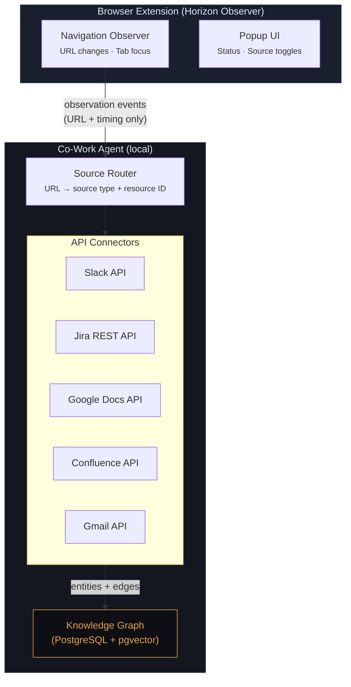

# Browser Extension Spec: Horizon Observer

The browser extension is a **signal layer** — it tells the AgentGraph backend what the user is looking at, not what's on the page. All content ingestion happens server-side via source APIs (Google Docs API, Discord API, etc.).

## Design Principles

1. **Signal, don't scrape.** The extension emits focus/blur events — URLs and timing. It never reads page content or DOM structure.
2. **Minimal permissions.** No content scripts, no host permissions beyond localhost. Just `tabs` and `activeTab`.
3. **Privacy-first.** Only URLs are sent to the local agent endpoint. No page content leaves the browser.
4. **Dumb client, smart server.** The extension emits events; the backend decides whether to act on them. No timers or logic on the client side.

## Architecture



## Focus/Blur Observer (service worker)

The service worker monitors browser activity and emits lightweight focus and blur (departure) events. The extension has no timers and no fetch logic — it just reports what the user is looking at and when they stop looking at it.

### Events Tracked

- `tabs.onActivated` — user switched to a tab → emit `focus`
- `tabs.onUpdated` — URL changed (navigation, SPA route change) → emit `blur` for old URL + `focus` for new
- `tabs.onRemoved` — tab closed → emit `blur`
- `windows.onFocusChanged` — user left/returned to browser → emit `blur`/`focus`

### Event Types

```typescript
interface FocusEvent {
  type: 'focus';
  url: string;
  title: string;          // document.title — already available via tabs API
  tabId: number;
  timestamp: string;      // ISO 8601
}

interface BlurEvent {
  type: 'blur';
  url: string;
  tabId: number;
  timestamp: string;      // ISO 8601
}
```

That's it. No content. No DOM. Just "the user is looking at this URL" and "the user stopped looking at this URL."

### Dwell Time (server-side)

The backend — not the extension — determines whether a focus event represents meaningful attention:

1. Backend periodically scans for `focus` events older than N seconds (e.g., 5s)
2. If no matching `blur` event exists within that window, the user is dwelling → trigger content fetch
3. If a `blur` arrived before N seconds, the user was just passing through → no fetch

This means rapid tab-switching through 10 channels produces 10 focus + 10 blur events but **zero API calls**. Only sustained attention triggers ingestion.

### Source Classification

The backend (not the extension) classifies URLs into sources and resource IDs:

```typescript
// Server-side, not in the extension
function classifyUrl(url: string): SourceReference | null {
  // Docs:    https://docs.google.com/document/d/1abc.../edit → gdocs doc 1abc...
  // Discord: https://discord.com/channels/123/456 → discord channel 456
  // etc.
}
```

This keeps the extension dumb and the intelligence server-side where it's easier to update.

### Batching & Resilience

- `blur` events flush immediately (the backend needs them promptly to evaluate dwell time).
- `focus` events batched and flushed every 2 seconds.
- If the agent endpoint is unavailable, events queue in-memory (max 500 events, ~15 minutes of activity).
- On reconnection, queued events flush in order.

## Popup UI

Minimal status and control interface.

### Status
- Agent connection status (green/red dot)
- Events sent in this session
- Last observation timestamp

### Source Toggles
- Enable/disable observation per domain pattern (e.g., `*.slack.com` ✓, `mail.google.com` ✗)
- Not per-source-type — just URL patterns

## Manifest V3

```json
{
  "manifest_version": 3,
  "name": "Horizon Observer",
  "version": "0.1.0",
  "description": "Observation layer for the Co-Work Agent",
  "permissions": [
    "tabs",
    "activeTab",
    "storage"
  ],
  "host_permissions": [
    "http://localhost/*"
  ],
  "background": {
    "service_worker": "background.js"
  },
  "action": {
    "default_popup": "popup/popup.html",
    "default_icon": {
      "16": "icons/icon-16.png",
      "48": "icons/icon-48.png",
      "128": "icons/icon-128.png"
    }
  },
  "icons": {
    "16": "icons/icon-16.png",
    "48": "icons/icon-48.png",
    "128": "icons/icon-128.png"
  }
}
```

No content scripts. No host permissions beyond localhost. No `webRequest`. Minimal attack surface.

### File Structure

```
horizon-observer/
├── manifest.json
├── background.js              # service worker — navigation observer
├── popup/
│   ├── popup.html
│   ├── popup.js
│   └── popup.css
├── lib/
│   ├── event-queue.js         # batching, queuing, retry
│   └── storage.js             # local config persistence (excluded URLs, toggles)
└── icons/
    ├── icon-16.png
    ├── icon-48.png
    └── icon-128.png
```

## Server-Side: API Connectors

Content ingestion lives entirely server-side. When the backend determines a dwell event warrants a fetch, it:

1. **Classifies** the URL → source type + resource ID
2. **Checks** whether this resource is already in the graph (and if it needs refreshing)
3. **Fetches** content via the source's API
4. **Extracts** entities and relationships
5. **Upserts** into the knowledge graph

### Connector Interface

Each connector is completely isolated behind this interface. Different connectors can be added and contributed independently over time.

```typescript
interface SourceConnector {
  source: string;                    // 'gdocs' | 'discord' | etc.
  canHandle(url: string): boolean;
  parseUrl(url: string): ResourceRef;
  fetch(ref: ResourceRef): Promise<EntityBatch>;
}

interface ResourceRef {
  source: string;
  resourceType: string;              // 'channel' | 'thread' | 'document' | etc.
  resourceId: string;                // channel ID, doc ID
}

interface EntityBatch {
  entities: Entity[];
  edges: Edge[];
  persons: Person[];
}
```

### Initial Connectors

**Google Docs**: On dwelling on a doc URL → fetch content via Google Docs API (`documents.get`), extract headings, comments, collaborators, edit history.

**Discord**: On dwelling on a channel/thread URL → fetch recent messages via Discord API, resolve users, extract thread structure, reactions, mentions.

Additional connectors (Slack, Jira, Confluence, Gmail, etc.) follow the same interface and can be developed independently.

### Refresh Policy

Not every dwell event triggers an API call. The backend checks:
- **First visit?** → Fetch from this point forward plus a small padding offset for immediate context
- **Visited recently but data is stale?** → Incremental fetch (e.g., new Discord messages since last fetch)
- **Visited recently and data is fresh?** → No fetch, just update `last_accessed`

Staleness thresholds per source:
| Source | Stale after |
|--------|-----------|
| Google Docs | 15 minutes |
| Discord | 5 minutes |

### Agent-Initiated Fetching

The browser extension is the primary trigger, but the agent can also fetch proactively:
- The agent notices a reference to a Google Doc in a Discord message and fetches the doc even though the user hasn't visited it
- Linked entities are pulled in as ambient context when a seed entity is fetched

## Security

- **Extension sends URLs only.** No page content, no cookies, no auth tokens.
- **All data stays local.** Extension → localhost. APIs called server-side.
- **API credentials stored server-side.** Extension has no access to source credentials.
- **User-controlled scope.** URL patterns can be excluded. Observation can be paused globally.
- **Minimal permissions.** `tabs`, `activeTab`, `storage`. No `webRequest`, no content scripts, no host permissions beyond localhost.

## Open Questions

1. **Dwell threshold tuning.** What's the right N seconds? Too short = false positives from slow tab-switching, too long = delayed context. Starting guess: 3-5 seconds.
2. **API rate limits.** Heavy browsing could trigger many API calls. Need per-source rate limiting and request coalescing server-side.
3. **Auth management.** Each source API needs credentials (OAuth tokens, API keys). How to handle token refresh, re-auth, multi-workspace?
4. **SPA detection.** Some tools don't update the URL on in-app navigation (Discord desktop app uses SPAs heavily). May need lightweight content script for specific SPAs that fires a custom event on route changes (still no content extraction — just "the view changed").
5. **Multi-device.** Browser extension only sees desktop browsing. Mobile usage is invisible.
6. **Firefox/Safari.** Start Chrome-only. Firefox Manifest V3 is similar enough. Safari requires App Extension — different effort entirely.
