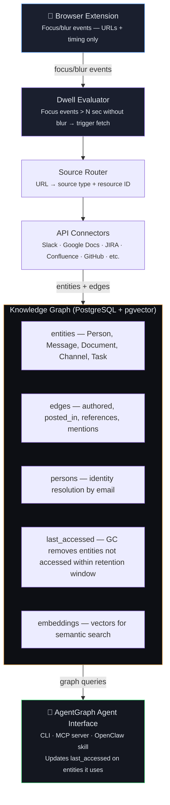

# AgentGraph

AgentGraph dynamically builds and maintains a **knowledge graph** of a user's business context by observing their real-time activity across enterprise tools, and provides a set of tools to allow an AI agent to be a more powerful personal assistant for work.

## Core Concept: The Landscape of Context

The co-work agent maintains a **landscape of context** — a knowledge graph that represents everything relevant to your work. The landscape is shaped by your attention: things enter when you look at them, persist while they're being used, and fall beyond the **horizon** when they haven't been accessed for long enough.

### Why This Works: The Coding Agent Insight

One of the reasons coding agents are so powerful is because **they have exploration primitives**. Through tools like `grep`, `read_file`, and `file_tree`, they can browse a codebase the same way a human developer does — cast a wide net, drill down, follow references, stumble onto relevant context. They don't need to formulate the perfect query upfront. The exploration is iterative and discovery-driven.

Most enterprise AI tools go the other direction: they try to answer questions through RAG retrieval, requiring the agent (or user) to know exactly what to ask for. If the query isn't well-formed, you get poor results. There's no browsing, no exploration, no serendipity.

**AgentGraph applies the coding agent pattern to business context:** give the agent exploration primitives over a knowledge graph of your systems of record. Just as coding agents use `grep` → `read_file` → follow imports, knowledge graph agents use `search_entities` → `get_entity` → `traverse_graph`. The substrate is different (graph vs filesystem), but the pattern is the same: **exploration through primitives, not retrieval through perfect queries.**

### How It Works

The agent is integrated with your browser. As you navigate through your systems of record — Slack, Google Docs, Jira, Confluence, email — the agent observes what you're interacting with and progressively incorporates that information into the landscape.

**Example flow:**

1. You visit a Slack public channel (`#platform-eng`) for the first time
   - Before this visit: the landscape contains **nothing** about `#platform-eng`
   - After: the agent fetches messages from this point forward (plus a small padding offset for immediate context) and ingests them into the graph
   - Each subsequent visit fetches new messages since the last fetch

2. You open a Google Doc ("Q2 OKRs")
   - The doc enters the landscape — its content, comments, and edit history are captured as entities and edges

3. You receive a Jira notification and click through to `PLAT-1234`
   - That ticket and its linked context enter the landscape
   - Related tickets, epic, and sprint context may get pulled in as ambient context

### The Landscape and its Horizon

The **landscape** is everything in the knowledge graph — the full terrain of context the agent can draw from. All data is stored at full fidelity. Nothing is degraded or summarised.

The **horizon** is the boundary. When entities haven't been accessed — by the user browsing or by the agent using them — within the retention window, they fall beyond the horizon and are removed from the graph. If the user revisits them later, they re-enter the landscape fresh.

Two things keep an entity inside the horizon:
1. **The user visits it** — the browser extension signals observation
2. **The agent uses it** — the agent traverses or retrieves it while answering a query

The landscape **shifts constantly** as your attention moves. New things enter. Untouched things eventually fall beyond the horizon. The landscape is a living representation of your working context, shaped by both human attention and agent activity.

### Key Principles

1. **Observation-driven, not configuration-driven.** You don't tell the agent what to watch. It watches what you actually use. This means the graph is always relevant to your real work patterns.

2. **Full fidelity.** Everything in the graph is stored as-is. Nothing is summarised or compressed. When entities fall beyond the horizon (not accessed within the retention window), they're removed entirely.

3. **Privacy by design.** The graph lives locally. The browser extension sends only URLs to the local agent. The user controls what sources are active.

4. **Exploration over retrieval.** Unlike RAG systems that require formulating the right query, AgentGraph gives agents primitives to *explore* — search for patterns, drill down on entities, follow graph edges, discover context. This mirrors how coding agents navigate codebases through tools, not magic.

## Architecture

### Storage Layer

The knowledge graph uses **PostgreSQL + pgvector** as the primary store, with an optional **Neo4j overlay** for complex multi-hop graph queries.

**PostgreSQL** stores:
- **Entities** (people, messages, documents, tickets, channels)
- **Typed edges** (authored, posted_in, references, mentions, assigned_to)
- **Cross-platform identity resolution** (email-keyed Person nodes with platform-specific identity links)
- **Embeddings** for semantic search (pgvector)
- **Full-text search** indexes (tsvector)

**Neo4j** (optional) provides ergonomic Cypher queries for relationship-heavy questions like "show me everything connected to this person within 2 hops across all platforms."

### Sync Architecture



**Three-phase sync:**

1. **Observation-triggered fetch** — When the user dwells on a resource (focus event > N seconds), the agent fetches it and related context via API
2. **Real-time webhooks** — Event-driven ingestion for platforms with webhook/subscription support (Slack, GitHub, JIRA, Salesforce CDC, Google Drive, etc.)
3. **Periodic reconciliation** — Scheduled delta queries to catch missed events, handle subscription expirations, and fill gaps from failed webhook deliveries

The extension stays lightweight — it only sends URLs and timing. The backend handles all API fetching, rate limiting, and graph construction.

### Dwell Time: Focus vs. Fetch

The extension emits lightweight focus/blur events. The **backend** decides whether to actually fetch content — not the extension, and not a client-side timer.

**How it works:**

1. User focuses a tab → extension emits a `focus` event (URL + timestamp)
2. User navigates away → extension emits a `blur`/departure event
3. The backend periodically scans for focus events older than N seconds that **don't have a matching departure event**
4. Only those durable focus events trigger content fetching via the source API

If the user clicks through 10 channels in quick succession, most will have departure events before N seconds elapse — no API calls. Only channels the user actually *dwells on* trigger ingestion. The extension stays dumb; all intelligence lives server-side.

## Agent Interface

AgentGraph exposes its knowledge graph to agents via:

- **MCP server** — Model Context Protocol tools for semantic search, graph traversal, and entity retrieval
- **CLI** — Command-line queries and exploration
- **[Agent Skill](https://agentskills.io/)** — Packaged as an agent skill for natural integration

### The Coding Agent Analogy

Just as coding agents interact with a codebase through tools that provide exploration primitives, AgentGraph provides equivalent primitives for graph exploration:

| Coding Agent Tool | Knowledge Graph Tool | What It Does |
|---|---|---|
| `grep` | `search_entities` | Cast a wide net — find entities matching a pattern |
| `read_file` | `get_entity` | Drill down — fetch full context for a specific entity |
| Follow imports | `traverse_graph` | Follow relationships — explore what's connected |
| `file_tree` | `query_by_filter` | Browse structure — list entities by type/properties |

**The key insight**: both give the agent **tools for iterative exploration**, not a single retrieval step. A coding agent uses `grep` to find candidates, `read_file` to examine them, and follows imports to gather context. A knowledge graph agent uses `search_entities` to find candidates, `get_entity` to examine them, and `traverse_graph` to gather related context. Same pattern, different substrate.

### Hybrid Retrieval

The most effective query strategy combines three methods:

1. **Vector similarity** (pgvector) — captures semantic meaning
2. **Full-text search** (PostgreSQL tsvector) — captures exact terminology
3. **Graph traversal** (SQL or Cypher) — captures structural relationships

Example MCP tools (primitives):

```python
@mcp.tool()
def search_entities(query: str, entity_types: list = None, limit: int = 10):
    """Hybrid semantic + full-text search. Returns entity IDs + snippets."""

@mcp.tool()
def get_entity(entity_id: str):
    """Retrieve full entity data by ID."""

@mcp.tool()
def get_edges(entity_id: str, edge_type: str = None, direction: str = "both"):
    """Get incoming/outgoing edges for an entity. Filter by edge type."""

@mcp.tool()
def traverse_graph(start_id: str, edge_types: list = None, max_depth: int = 2):
    """Multi-hop traversal. Returns subgraph."""

@mcp.tool()
def query_by_filter(entity_type: str, filters: dict, limit: int = 50):
    """Structured query: entity type + property filters."""
```

These primitives let the agent compose higher-level queries (like "get person context" or "project status") by combining search, retrieval, and traversal.

## Platform Coverage

AgentGraph provides example integration platforms:

- **Communications:** Slack, Microsoft Teams
- **Collaboration:** Google Workspace (Drive, Docs, Gmail), Microsoft 365 (SharePoint, OneDrive)
- **Dev & Project:** JIRA, Confluence, GitHub, Trello, Monday.com
- **Systems of Record:** Salesforce, Workday

See [unified-knowledge-graph-saas.md](unified-knowledge-graph-saas.md) for detailed API documentation, rate limits, webhook support, and connector architecture.

### What Makes This Different

| Approach | Limitation | AgentGraph |
|----------|-----------|-----------|
| **RAG over docs** | Lossy retrieval, no navigation, no relationships | Lossless graph with full traversal |
| **MCP/tool-calling** | Agent must know what to ask for; can't browse | Agent can explore and discover |
| **Chat-with-your-data** | Single-turn Q&A, no persistent context | Living graph shaped by attention |
| **Knowledge graphs** | Great for relationships, bad for nuance | Hybrid: graph + vectors + full-text |

The crucial difference: **the agent explores through primitives, not perfect queries.** Just as a coding agent doesn't need to know the exact file path before exploring a codebase, a knowledge graph agent can search, examine, traverse, and discover — iteratively building understanding through tool use.

## Research

| Document | Description |
|----------|-------------|
| [unified-knowledge-graph-saas.md](unified-knowledge-graph-saas.md) | Detailed API docs, schema design, and connector architecture for 12 platforms |
| [garbage-collection-horizon-decay.md](garbage-collection-horizon-decay.md) | How the horizon determines what stays in the graph and what gets removed |
| [browser-extension-spec.md](browser-extension-spec.md) | Horizon Observer extension — observation protocol, focus/blur events |
| [knowledge-graph-explorer.jsx](knowledge-graph-explorer.jsx) | Interactive UI prototype for visualising the knowledge graph (React) |

## Open Questions

- **Dwell threshold?** What's the right N seconds before a focus event triggers a fetch? Too short = noisy, too long = delayed context. Probably 3-5 seconds.
- **Padding offset per source?** On first visit, we fetch from now plus a small padding offset. What's the right default per source type?
- **Cross-platform entity resolution?** Email works for person identity, but how do we link documents/projects across platforms when they don't share explicit references?
- **Multi-device?** Browser extension only sees desktop browsing. Mobile usage is invisible.
- **Shared landscapes?** Could team members share portions of their landscapes for collaborative context?
